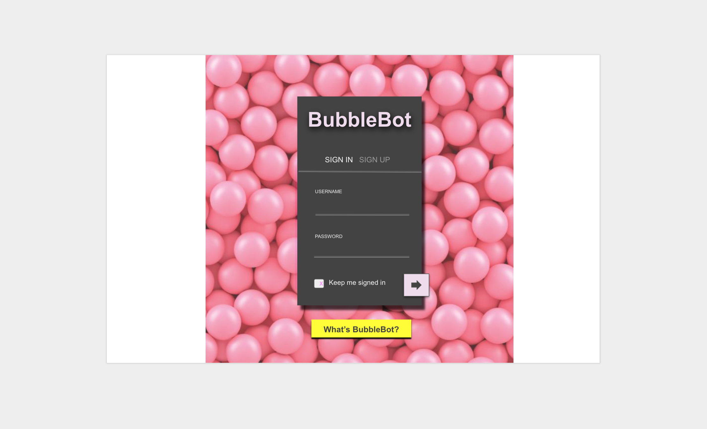
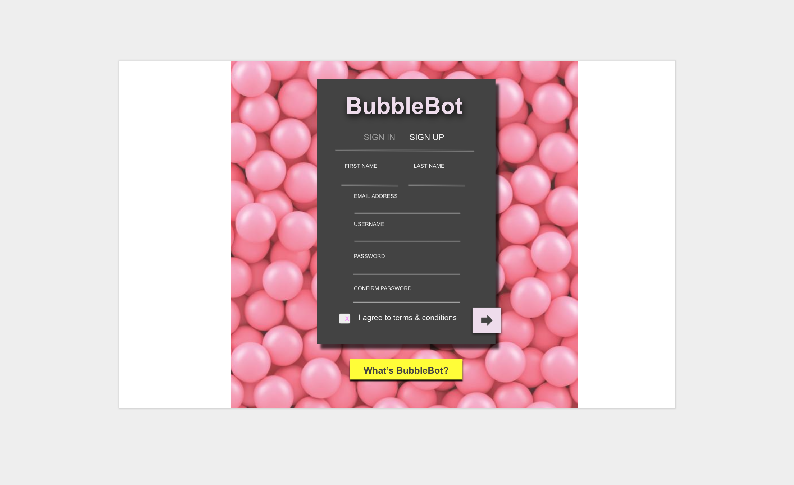
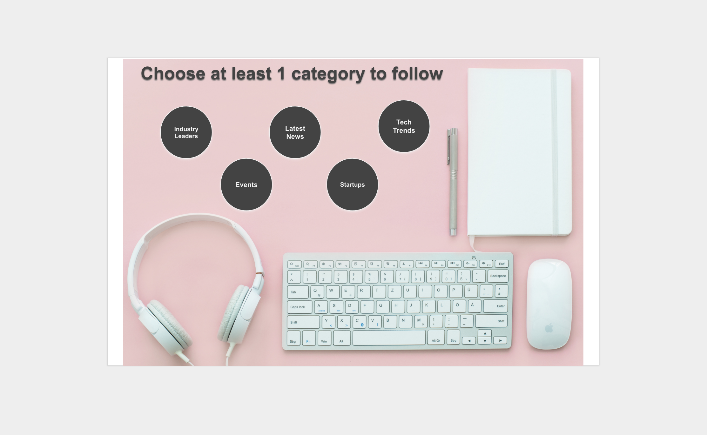
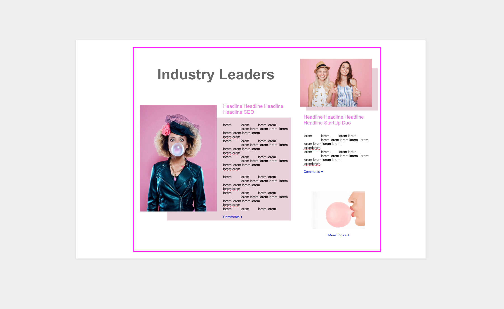
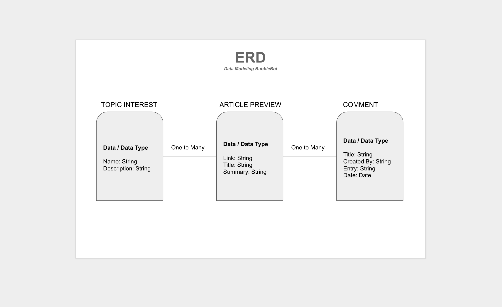

# BubbleBot
AJ's First Full-Stack App

**Link to Deployed App on Heroku:** <https://ancient-ocean-75544.herokuapp.com/>  

**Link to User Stories on Trello:** <https://trello.com/b/qwen5xAT/bubblebot>

## Project Description

The goal of this project was to create a full stack application using Express.js and MongoDB. Bubblebot is an original idea and it is meant to be a technology news outlet focused on women leaders in technology. After signing up for Bubblebot, a user will be able to choose topics of interest to follow. After choosing their topics, they will recieve articles based on those topics with the ability to comment on what they've read.

## Technologies Used

  * Frameworks - Express.js, MongoDB
  * Languages - HTML5, CSS3
  * Wireframe - Google Slides
  * Project Planning & User Stories - [Trello](https://trello.com/b/qwen5xAT/bubblebot)
  * Deployment - Heroku - [Heroku](https://ancient-ocean-75544.herokuapp.com/)
  * Visual Studio Code
  * iTerm

## Features
 
  * Sign In/Sign Up
  * CRUD
  * ERD Data Model

## Wireframe

## Additions to a Future Version

  * Store Users that Sign Up
  * Add ability to comment
  * Finish Styling
  * Use Materlialize Framework
  * Make mobile responsive
  * Add animations